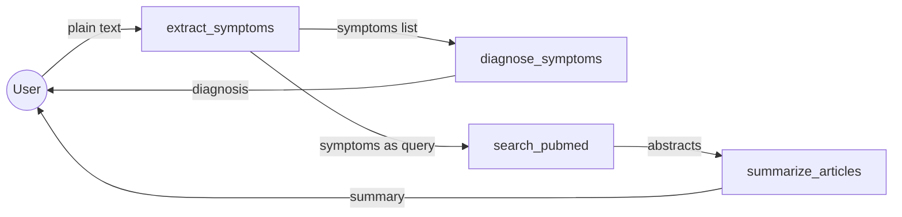

# Medical Tools MCP Server

MCP server demonstrating a **multi-tool pipeline** — four tools that chain together to go from a free-text symptom description to summarized medical research. Combines OpenAI for NLP and the free PubMed API for real research articles. Includes a Streamlit app that guides users through the full pipeline.

---

## Architecture

```
┌───────────────────────────────────────────────────────────────────────────┐
│                         Streamlit App (app.py)                             │
│                                                                           │
│  ┌──────────────┐   ┌──────────────┐   ┌───────────┐   ┌────────────┐  │
│  │ Enter text   │──►│ Extract      │──►│ Diagnose  │──►│ Search     │  │
│  │ (free-form)  │   │ Symptoms     │   │ Symptoms  │   │ PubMed     │  │
│  └──────────────┘   └──────────────┘   └───────────┘   └─────┬──────┘  │
│                                                               │          │
│                                                               ▼          │
│                                                         ┌────────────┐   │
│                                                         │ Summarize  │   │
│                                                         │ Articles   │   │
│                                                         └────────────┘   │
│                              (calls MCP tools via stdio_client)           │
└──────────────────────────────────────────────────────────┬────────────────┘
                                                           │ stdio (JSON-RPC)
                                                           ▼
┌───────────────────────────────────────────────────────────────────────────┐
│                         MCP Server (server.py)                             │
│                                                                           │
│  ┌────────────────┐  ┌──────────────────┐  ┌──────────────────────────┐ │
│  │extract_symptoms│  │diagnose_symptoms  │  │search_pubmed             │ │
│  │  (OpenAI)      │  │  (OpenAI)         │  │  (NCBI eUtils — free)    │ │
│  └────────────────┘  └──────────────────┘  └──────────────────────────┘ │
│                                                                           │
│  ┌────────────────────────┐  ┌──────────────────────────────────────┐   │
│  │summarize_articles      │  │Resource: medical://disclaimer         │   │
│  │  (OpenAI)              │  │  (safety notice for LLMs to surface)  │   │
│  └────────────────────────┘  └──────────────────────────────────────┘   │
└───────────────────────────────────────────────────────────────────────────┘
```

**Server (`server.py`):** A single-file MCP server with 4 tools and 1 resource. Three tools use OpenAI for NLP tasks; one tool calls the free PubMed/NCBI API for real research articles. The server returns structured data (JSON) that clients can parse and pass to subsequent tools.

**Client (`app.py`):** A Streamlit web application that acts as the MCP client. It walks the user through the pipeline step by step, storing intermediate results in session state and passing context from one tool to the next automatically.

---

## How MCP works here

1. User opens the Streamlit app and types their symptoms in plain language
2. When "Extract Symptoms" is clicked:
   - App spawns `server.py` as a subprocess via `stdio_client`
   - Sends `CallToolRequest` for `extract_symptoms` with the raw text
   - Server calls OpenAI to parse natural language → returns JSON `{symptoms: [...], original_text: "..."}`
3. The extracted symptoms are stored in session state
4. "Get Diagnosis" passes those symptoms to `diagnose_symptoms` → returns markdown text with possible causes
5. "Search PubMed" passes symptom keywords to `search_pubmed` → returns JSON array of real articles with PMIDs, titles, abstracts, and URLs
6. "Summarize Articles" passes the abstracts to `summarize_articles` → returns a structured medical summary
7. Each step builds on the previous — **the client orchestrates, the server executes**

**Key insight:** The tools are designed to be **composable** — an LLM (or a UI) can chain them in sequence, but each tool also works standalone.

---

## MCP features demonstrated

| Feature | What it shows |
|---|---|
| **Tool chaining** | 4 tools designed to pipe into each other: text → symptoms → diagnosis + articles → summary |
| **Mixed APIs** | OpenAI for NLP tasks, PubMed (free NCBI eUtils) for real research data |
| **Resources** | `medical://disclaimer` — safety context that responsible LLMs should surface |
| **JSON serialization** | `search_pubmed` returns structured JSON that downstream tools can parse |
| **Streamlit as MCP client** | Step-through UI with context flowing between tool calls |
| **XML parsing** | Server parses PubMed's XML response using BeautifulSoup |

---

## Tools

| Tool | Parameters | Returns | API used |
|---|---|---|---|
| `extract_symptoms` | `text: str` | JSON: `{symptoms: [...], original_text: "..."}` | OpenAI |
| `diagnose_symptoms` | `symptoms: list[str]` | Markdown: possible causes, red flags, next steps | OpenAI |
| `search_pubmed` | `query: str`, `max_results: int = 3` | JSON array: `[{pmid, title, abstract, url}, ...]` | NCBI eUtils (free) |
| `summarize_articles` | `abstracts: list[str]` | Markdown: objective, findings, relevance, limitations | OpenAI |

## Resources

| URI | Description |
|---|---|
| `medical://disclaimer` | Medical disclaimer — "not a substitute for professional advice" |

---

## Setup

```bash
# Install dependencies (from repo root)
uv sync --extra clinisight

# Required env vars in .env (at repo root)
OPENAI_API_KEY=sk-...
```

No PubMed API key needed — the NCBI eUtils API is free for reasonable use (< 3 requests/second).

---

## Running

### Streamlit app (recommended)

Step through the full pipeline via a visual UI — context flows automatically between tools:

```bash
# From repo root
uv run streamlit run examples/medical-tools/app.py
```

1. Type your symptoms in plain language
2. Click **Extract Symptoms** → see structured symptom list
3. Click **Get Diagnosis** → see possible causes and red flags
4. Adjust article count with slider → click **Search PubMed** → see real papers
5. Click **Summarize Articles** → get a structured research summary
6. Click **Start Over** to reset

### MCP Inspector

Test individual tools directly without the web UI:

```bash
uv run mcp dev examples/medical-tools/server.py
```

1. **Tools** → `extract_symptoms` with text: `"I have a terrible headache and my neck is stiff"`
2. Copy the symptoms → `diagnose_symptoms` with `symptoms: ["headache", "stiff neck"]`
3. Try `search_pubmed` with query: `"headache stiff neck"`
4. Copy abstracts → `summarize_articles`
5. **Resources** → read `medical://disclaimer`

### Programmatic client (Python)

```python
import asyncio, os, json
from mcp import ClientSession, StdioServerParameters
from mcp.client.stdio import stdio_client

async def main():
    params = StdioServerParameters(
        command="uv", args=["run", "python", "examples/medical-tools/server.py"],
        env={**os.environ}  # Required for OpenAI API access in subprocess
    )
    async with stdio_client(params) as (read, write):
        async with ClientSession(read, write) as session:
            await session.initialize()

            # Step 1: Extract symptoms from free text
            r = await session.call_tool("extract_symptoms", {
                "text": "I have a terrible headache and my neck is really stiff"
            })
            data = json.loads(r.content[0].text)
            symptoms = data["symptoms"]  # ["headache", "stiff neck"]

            # Step 2: Get diagnosis
            r = await session.call_tool("diagnose_symptoms", {"symptoms": symptoms})
            print(r.content[0].text)

            # Step 3: Search PubMed
            r = await session.call_tool("search_pubmed", {
                "query": " ".join(symptoms), "max_results": 3
            })
            articles = json.loads(r.content[0].text)

            # Step 4: Summarize
            abstracts = [a["abstract"] for a in articles if a["abstract"] != "No abstract available"]
            r = await session.call_tool("summarize_articles", {"abstracts": abstracts})
            print(r.content[0].text)

asyncio.run(main())
```

---

## Example tool chain

```
> extract_symptoms("I have a terrible headache and my neck is really stiff. Also feeling nauseous.")
{
  "symptoms": ["headache", "stiff neck", "nausea"],
  "original_text": "I have a terrible headache and my neck is really stiff. Also feeling nauseous."
}

> diagnose_symptoms(["headache", "stiff neck", "nausea"])
### Possible Causes:
1. **Migraine** — severe headache often with nausea and sensitivity to light
2. **Tension headache** — can cause neck stiffness and mild nausea
3. **Meningitis** — RED FLAG if combined with fever, seek immediate care
4. **Cervicogenic headache** — originates from neck problems
5. **Dehydration** — common cause of headache and nausea

### Red Flags:
- High fever + stiff neck → possible meningitis, seek emergency care
- Sudden "worst headache of your life" → possible aneurysm

### Next Steps:
- Track symptoms: duration, triggers, associated fever
- Stay hydrated, rest in a dark room
- See a doctor if symptoms persist > 48 hours or worsen

> search_pubmed("headache stiff neck nausea", max_results=2)
[
  {
    "pmid": "42533183",
    "title": "Ultrasound-Guided Greater Occipital Nerve Block Across Headache Phenotypes...",
    "abstract": "Objective: To evaluate the short-term effectiveness...",
    "url": "https://pubmed.ncbi.nlm.nih.gov/42533183/"
  },
  {
    "pmid": "42532410",
    "title": "Real-life effectiveness, tolerability, and safety of atogepant...",
    "abstract": "Background: Atogepant is a CGRP receptor antagonist...",
    "url": "https://pubmed.ncbi.nlm.nih.gov/42532410/"
  }
]

> summarize_articles([<abstracts from above>])
**Study 1: Greater Occipital Nerve Blocks in Chronic Headache**
- **Objective:** Evaluate short-term effectiveness of ultrasound-guided GONB
- **Key Findings:** Significant improvements in pain (NRS 8→4), headache impact, sleep quality
- **Clinical Relevance:** GONB may be effective across multiple headache phenotypes
- **Limitations:** Single-center, no control group

**Study 2: Atogepant for Migraine Prevention**
- **Objective:** Assess real-world effectiveness of atogepant (CGRP antagonist)
- **Key Findings:** Reduction in monthly migraine days, well-tolerated
- **Clinical Relevance:** Oral preventive option for patients who failed other treatments
- **Limitations:** Observational design, short follow-up
```

---

## Pipeline flow



---

## File structure

```
medical-tools/
  server.py     ← MCP server with 4 tools + 1 resource (single file)
  app.py        ← Streamlit web UI that chains all 4 tools (MCP client)
  README.md
```

---

## Key takeaways

- **Tool chaining** is the core pattern — each tool outputs data that feeds the next
- **JSON return types** enable structured passing between tools (vs. plain text that needs re-parsing)
- **Free APIs** (PubMed) mixed with paid APIs (OpenAI) — MCP doesn't care about the backend
- **BeautifulSoup + XML parser** for handling PubMed's XML responses (use `"xml"` not `"lxml"` for XML content)
- **`Path(__file__)`** for robust `.env` loading regardless of working directory
- **`env={**os.environ}`** when spawning subprocess — without this, the child can't reach external APIs
- **Resources as safety rails** — `medical://disclaimer` gives LLMs important context to surface
